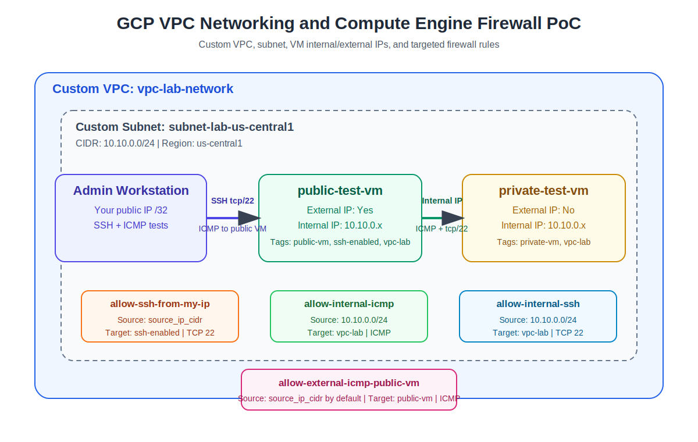

# GCP VPC Networking and Compute Engine Firewall PoC

This repository demonstrates a Google Cloud networking lab using **Terraform**, **Compute Engine**, a **custom VPC**, a **custom subnet**, and targeted **firewall rules**. It is designed as a portfolio-ready proof of concept for the lab: **Get Started with Virtual Private Cloud Networking and Compute Engine**.

## Objectives

This PoC showcases the ability to:

- Create a custom VPC and subnet instead of using the default network.
- Deploy Compute Engine VM instances with internal and external IP configurations.
- Restrict SSH access to a trusted public IP range.
- Allow internal private IP communication between VMs.
- Allow external ICMP to a selected public VM.
- Validate connectivity using SSH, ICMP, private IP routing, and firewall rule behavior.
- Document deployment, testing, troubleshooting, and cleanup steps.

## Architecture



### High-level flow

```text
Internet / Admin Workstation
        |
        | SSH tcp/22 from trusted source_ip_cidr
        | ICMP to public VM only
        v
+--------------------+          Internal ICMP / SSH          +---------------------+
| public-test-vm     | ------------------------------------> | private-test-vm     |
| External IP: Yes   |          10.10.0.0/24 only            | External IP: No     |
| Internal IP: Yes   |                                       | Internal IP: Yes    |
+--------------------+                                       +---------------------+

Both VMs are deployed in:
Custom VPC: vpc-lab-network
Custom Subnet: subnet-lab-us-central1, 10.10.0.0/24
```

## Skills demonstrated

| Skill | Evidence in this repo |
|---|---|
| VPC design | `google_compute_network` with custom subnet mode |
| Subnet CIDR planning | `10.10.0.0/24` custom subnet |
| Compute Engine | Public and private Debian VMs |
| Internal IP networking | ICMP and SSH allowed from `10.10.0.0/24` |
| External IP access | Public VM receives an ephemeral external IP |
| Firewall rule design | Separate rules for SSH, internal ICMP, internal SSH, and external ICMP |
| Network tags | Firewall rules target specific tagged instances |
| Security awareness | SSH is restricted to `source_ip_cidr` |
| Infrastructure as Code | Complete Terraform implementation |
| Validation and troubleshooting | Commands and docs included |

## Repository structure

```text
gcp-vpc-compute-firewall-poc/
├── README.md
├── architecture/
│   └── architecture-diagram.svg
├── docs/
│   ├── cleanup.md
│   ├── lab-notes.md
│   └── troubleshooting.md
├── screenshots/
│   └── .gitkeep
├── scripts/
│   ├── startup-script.sh
│   └── validate-connectivity.sh
└── terraform/
    ├── main.tf
    ├── outputs.tf
    ├── terraform.tfvars.example
    ├── variables.tf
    └── versions.tf
```

## Prerequisites

- Google Cloud project with billing enabled.
- Google Cloud SDK installed and authenticated.
- Terraform installed.
- Compute Engine API enabled.
- Your public IP address in CIDR notation, for example `203.0.113.10/32`.

Enable the Compute Engine API:

```bash
gcloud services enable compute.googleapis.com
```

Get your current public IP:

```bash
curl ifconfig.me
```

## Deployment steps

From the repository root:

```bash
cd terraform
cp terraform.tfvars.example terraform.tfvars
```

Edit `terraform.tfvars`:

```hcl
project_id     = "your-gcp-project-id"
region         = "us-central1"
zone           = "us-central1-a"
source_ip_cidr = "YOUR_PUBLIC_IP/32"

allow_external_icmp_from_anywhere = false
```

Initialize and deploy:

```bash
terraform init
terraform fmt
terraform validate
terraform plan
terraform apply
```

## Validation tests

After `terraform apply`, Terraform prints outputs for the VM names and IP addresses.

### Test 1: SSH to public VM

```bash
gcloud compute ssh public-test-vm --zone us-central1-a
```

Expected result:

```text
SSH connection succeeds because the allow-ssh-from-my-ip firewall rule allows tcp/22 from source_ip_cidr.
```

### Test 2: Ping public VM external IP

```bash
ping <PUBLIC_VM_EXTERNAL_IP>
```

Expected result:

```text
ICMP replies are received if your source IP is allowed by allow-external-icmp-public-vm.
```

### Test 3: Ping private VM over internal IP

From inside `public-test-vm`:

```bash
ping <PRIVATE_VM_INTERNAL_IP>
```

Expected result:

```text
ICMP replies are received over the private VPC network because allow-internal-icmp permits traffic from 10.10.0.0/24.
```

### Test 4: Check internal SSH reachability

From inside `public-test-vm`:

```bash
nc -vz <PRIVATE_VM_INTERNAL_IP> 22
```

Expected result:

```text
The private VM's SSH port is reachable over the internal IP because allow-internal-ssh permits tcp/22 from 10.10.0.0/24.
```

### Test 5: Prove firewall behavior

Disable or remove the internal ICMP firewall rule, then retry:

```bash
ping <PRIVATE_VM_INTERNAL_IP>
```

Expected result:

```text
Ping fails, proving that connectivity depends on the VPC firewall rule.
```

Re-enable the rule and retry. Ping should succeed again.

## Automated validation helper

Run this from the repository root after deployment:

```bash
./scripts/validate-connectivity.sh us-central1-a public-test-vm <PRIVATE_VM_INTERNAL_IP> <PUBLIC_VM_EXTERNAL_IP>
```

## Firewall rules created

| Rule | Direction | Source | Target | Protocol / Port | Purpose |
|---|---|---|---|---|---|
| `allow-ssh-from-my-ip` | Ingress | `source_ip_cidr` | `ssh-enabled` | TCP 22 | Admin SSH to public VM |
| `allow-internal-icmp` | Ingress | `10.10.0.0/24` | `vpc-lab` | ICMP | Private ping between lab VMs |
| `allow-internal-ssh` | Ingress | `10.10.0.0/24` | `vpc-lab` | TCP 22 | Private SSH reachability inside VPC |
| `allow-external-icmp-public-vm` | Ingress | `source_ip_cidr` by default | `public-vm` | ICMP | External ping to public VM only |

## Screenshots to add

After deploying, add screenshots to the `screenshots/` folder:

- `vm-instances.png` - VM list showing public and private VMs.
- `vpc-network.png` - Custom VPC details.
- `subnet-details.png` - Custom subnet and CIDR.
- `firewall-rules.png` - Created firewall rules.
- `ssh-test.png` - Successful SSH to public VM.
- `ping-public-external-ip.png` - Successful external ICMP test.
- `ping-private-internal-ip.png` - Successful private ICMP test.
- `failed-ping-firewall-disabled.png` - Failed ping after disabling firewall rule.
- `terraform-apply-output.png` - Terraform apply output.

## Key learning note

Google Cloud VPC firewall rules are stateful and apply at the network level. Even if two VMs are in the same VPC and subnet, ingress traffic must be explicitly allowed by a matching firewall rule. This PoC demonstrates controlled access using source ranges, target tags, and protocol-specific rules.

## Cleanup

To avoid ongoing costs:

```bash
cd terraform
terraform destroy
```

See [docs/cleanup.md](docs/cleanup.md) for detailed cleanup guidance.
